  

I build local tools for documents, research collections and visual thinking.

## Selected projects

**[Miro Canvas](https://github.com/NixWrk/Obsidian-Plugin---Miro-Canvas)** 
Visual boards in Obsidian, with notes, shapes, drawings and comments.

**[Miro to Obsidian](https://github.com/NixWrk/Miro_2_Obsidian)** 
Bring Miro boards into your vault, with local attachments and source metadata.

**[UniScan](https://github.com/NixWrk/img_2_pdf)** 
Straighten, clean and assemble scanned pages before OCR.

**[Surya Chandra PDF OCR](https://github.com/NixWrk/Surya_Chandra_PDF_OCR)** 
Turn scanned PDFs into searchable documents with aligned text layers.

**[Claude Code Local Model Switcher](https://github.com/NixWrk/Claude_Code_Local_LLM_Switcher_LM_Studio)** 
Run local models with Claude Code in an isolated VS Code workspace.

More tools

- **Zotero:** [metadata and full text](https://github.com/NixWrk/Zotero_Ingest_Worker), [PDF to HTML](https://github.com/NixWrk/scholarly-pdf-html-worker), [metadata mapping](https://github.com/NixWrk/Zotero_Integration_Metadata_Mapping).
- **Obsidian:** [vault diagnostics and repair](https://github.com/NixWrk/Obsidian_Doctor).
- **OCR:** [hOCR bridge](https://github.com/NixWrk/surya_hOCR_bridge), [Surya plugin](https://github.com/NixWrk/Surya_OCRmyPDF_Plugin), [Chandra plugin](https://github.com/NixWrk/Chandra_OCRmyPDF_Plugin).
- **Research:** [scientific evidence workflows](https://github.com/NixWrk/NIX_scientific-evidence-skill), [sensitometry](https://github.com/NixWrk/ISO_Sensitometer_GUI).

---

[All repositories](https://github.com/NixWrk?tab=repositories&type=source) · [Questions & collaboration](https://github.com/NixWrk/NixWrk/issues)
